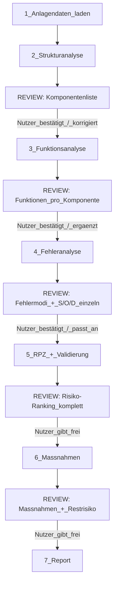
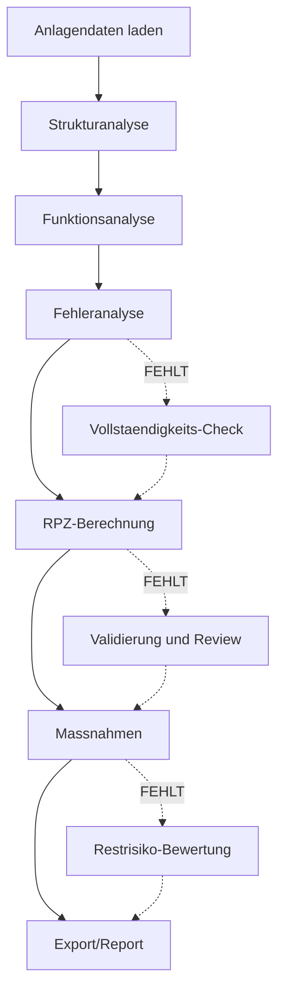

# RiskAI-Agent: Analyse und Optimierungsempfehlungen

---

## 0. Kernproblem: Fehlende menschliche Einbindung (Human-in-the-Loop)

### Ist-Zustand

Die aktuelle Pipeline ist ein **Batch-Prozess**: Anlagendaten rein, Bericht raus. Der Nutzer sieht erst am Ende das Ergebnis. Das ist problematisch, weil:

- Eine FMEA ist ein **Team-basierter Prozess** -- die KI kann Risiken vorschlagen, aber nur der Mensch mit Anlagenkenntnis kann sie verantwortlich freigeben
- Auch bei "niedrigen" Risiken kann die KI falsch liegen -- ein Mensch muss das pruefen koennen
- Regulatorisch hat eine FMEA ohne dokumentierte menschliche Freigabe in einem Audit keinen Bestand

### Soll-Zustand: Interaktiver FMEA-Prozess




### Wie das konkret aussieht

**Nach Schritt 2 (Strukturanalyse):** Ich praesentiere dir die erkannten Komponenten als uebersichtliche Tabelle:

> "Ich habe 47 Komponenten in 3 Systemen erkannt. Hier die Zusammenfassung:
>
> - Synthesereaktor R-101: 8 Equipment, 7 MSR, 4 Sicherheit
> - Dosiersystem DS-200: 5 Equipment, 6 MSR, 1 Sicherheit
> - Mediensystem MS-300: 6 Equipment, 6 MSR, 1 Sicherheit
>
> Fehlt eine Komponente? Ist eine Zuordnung falsch?"

Du kannst korrigieren ("Der TI-301 gehoert eigentlich zum Reaktor, nicht zum Mediensystem") und dann erst gehen wir weiter.

**Nach Schritt 3 (Funktionsanalyse):** Pro Komponente zeige ich die identifizierten Funktionen:

> "Fuer Synthesereaktor R-101 habe ich 5 Funktionen identifiziert:
>
> 1. F1: Bereitstellung Reaktionsraum fuer Fischer-Veresterung bei 80°C / 1 bar
> 2. F2: Dichtheit gegenueber Ethanol, Essigaesure, H2SO4, Ethylacetat
> 3. ...
>
> Fehlt eine Funktion? Soll eine priorisiert werden?"

**Nach Schritt 4 (Fehleranalyse) -- Der wichtigste Review-Punkt:**
Hier gehe ich **jeden Fehlermodus einzeln** mit dir durch:

> "**F2-FM1: Flanschleckage am Mannloch**
>
> - Ursachen: Dichtung versproeded, falsches Drehmoment, falsche Spezifikation, Spaltkorrosion
> - Folgen: Veraetzung (Mensch), VOC (Umwelt), 3-5 Tage Stillstand (Anlage)
> - Controls: Visuelle Inspektion, Auffangwanne
> - Meine Bewertung: **S=8** (Verbrennungsgefahr), **O=4** (Dichtung altert, ~alle 2 Jahre), **D=6** (nur visuelle Pruefung)
> - **RPZ = 192 (MITTEL)**
>
> Stimmst du zu? Oder wuerdest du z.B. O hoeher bewerten, weil die Dichtung haeufiger versagt?"

Du kannst dann antworten: "O wuerde ich auf 5 setzen, wir hatten letztes Jahr 3 Leckagen" -- und ich passe die DB sofort an.

**Nach Schritt 5 (RPZ-Ranking):** Gesamtuebersicht aller Risiken als sortierte Tabelle mit Ampelfarben. Du gibst das Ranking frei oder markierst Risiken zum Nachbessern.

**Nach Schritt 6 (Massnahmen):** Pro Massnahme: Vorher/Nachher-Vergleich, Kosten-Nutzen-Abschaetzung. Du gibst jede Massnahme einzeln frei.

### Was dafuer implementiert werden muss

1. `**workflows/fmea_analyse.md` umbauen**: Review-Punkte nach jedem Schritt einbauen. Klare Anweisungen, wann der Agent dem Nutzer Ergebnisse praesentiert und auf Feedback wartet.
2. `**tools/review.py` (neu)**: Hilfstool das aus der DB formatierte Review-Zusammenfassungen erzeugt:
  - `get_structure_review(project_id)` -- Komponenten-Uebersicht
  - `get_function_review(project_id, component_id)` -- Funktionen einer Komponente
  - `get_risk_review(project_id, failure_mode_id)` -- Einzelner Fehlermodus mit S/O/D-Begruendung
  - `get_ranking_review(project_id)` -- Sortierte Risiko-Tabelle
  - `get_measure_review(project_id)` -- Massnahmen mit Vorher/Nachher
  - `update_from_feedback(...)` -- Nutzer-Aenderungen in DB zurueckschreiben
3. **Feedback-Dokumentation im Report**: Der Bericht zeigt am Ende, welche Bewertungen vom Nutzer angepasst wurden (Audit-Trail). Das gibt dem Report regulatorische Glaubwuerdigkeit.

### Aufwand und Reihenfolge

Der interaktive Workflow ist die **wichtigste Aenderung** und sollte als erstes umgesetzt werden, weil:

- Er verbessert die **Qualitaet** der Analyse massiv (Expertenwissen fliesst ein)
- Er gibt dem Ergebnis **regulatorische Legitimation** (Human Review dokumentiert)
- Alle anderen Verbesserungen (Optik, Charts, Validierung) sind Add-ons, die darauf aufbauen

---

## 1. Was faellt mir auf -- Luecken und Schwaechen

### 1.1 FMEA-Parameter sind ueberall verstreut und hartcodiert

Aktuell sind die FMEA-Konfigurationswerte ueber mehrere Dateien verteilt:

- **RPZ-Grenzen** (300/200/100) in `rpz_calculator.py` (Zeile ~30)
- **S/O/D-Skalen** (Beschreibungen, Haeufigkeiten) in `report_generator.py` (S_INFO, O_INFO, D_INFO Dicts)
- **RPZ-Farben** in `report_generator.py` (Chart-Code) und `fmea_style.css` (CSS-Variablen)
- **Fehlerart-Kategorien** in `fehleranalyse.md`

Das ist fehleranfaellig: Wenn man z.B. die RPZ-Grenzen aendern will, muss man in mehreren Dateien gleichzeitig suchen. Die Loesung ist eine **zentrale Konfigurationsdatei** `config/fmea_standards.py`, die als Single Source of Truth fuer alle FMEA-Parameter dient.

Die aktuellen RPZ-Grenzen (300/200/100) bleiben bestehen -- sie koennen spaeter jederzeit ueber die Config angepasst werden, ohne Code zu aendern. Langfristig koennten auch verschiedene Branchenprofile (Standard, Automotive, Pharma, Aerospace) als Presets unterstuetzt werden.

### 1.2 FMEA-Sonderregeln fehlen

Die Web-App hat wichtige Safety-Overrides, die im Agent fehlen:

- **B >= 9 --> mindestens "hoch"** (Sicherheitsrelevanz erzwingt Massnahme)
- **E >= 9 und B >= 7 --> "kritisch"** (schlechte Entdeckbarkeit bei hoher Bedeutung)
- Diese Regeln sind AIAG-VDA-konform und industriell gefordert.
- **Gehoeren in die zentrale `config/fmea_standards.py`** als konfigurierbare Sonderregeln.

### 1.3 Kein Review/Validierungs-Schritt

Die aktuelle Pipeline laeuft linear durch (Struktur -> Funktionen -> Fehler -> RPZ -> Massnahmen -> Report). Es fehlt ein **abschliessender Konsistenz-Check**, der die gesamte Analyse als Ganzes prueft:

- **Doppelungs-Erkennung**: Gibt es zwei Fehlermodi, die praktisch dasselbe beschreiben, aber unter verschiedenen Funktionen stehen?
- **Kontext-Abgleich**: Passt die Analyse zum urspruenglichen Anlagenkontext? (z.B. Ex-Zone 1 muss sich in allen Leckage-Fehlermodi widerspiegeln; Flammpunkt < 0°C muss die Severity beeinflussen)
- **S/O/D-Konsistenz**: Wenn ein aehnlicher Fehlermodus an Pumpe A S=8 bekommt, sollte ein vergleichbarer an Pumpe B nicht S=4 haben
- **Plausibilitaetspruefung**: S=10 ohne Massnahme = sofortiger Handlungsbedarf; S=1 bei Gefahrstoff-Freisetzung = unplausibel
- **Vollstaendigkeitspruefung**: Hat jede Funktion mindestens einen Fehlermodus? Haben alle Fehlermodi begruendete S/O/D-Werte?
- **Stimmigkeit mit Gesamtbild**: Passen die einzelnen Ergebnisse zusammen, wenn man sie im Kontext der gesamten Anlage betrachtet?

### 1.4 Stoffdaten nicht automatisch angereichert

Die Web-App hat PubChem/ChemSpider-Integration fuer automatische Stoffdaten. Der Agent uebernimmt nur das, was in den Anlagendaten steht. Fehlende GHS-Daten koennten die Severity-Bewertung verfaelschen.

### 1.5 Zwei Report-Generatoren

`report.py` (fpdf2) und `report_generator.py` (Playwright/HTML) existieren parallel. `report.py` wird nicht mehr benutzt, sollte entfernt oder archiviert werden.

---

## 2. Fehlende Schritte in der Risikoanalyse




Konkret fehlen diese Schritte:

- **Vollstaendigkeits-Check** nach der Fehleranalyse: Prueft ob jede Funktion Fehlermodi hat, ob alle Ursachen Controls haben, ob S/O/D begruendet sind
- **Validierung/Review** nach der RPZ-Berechnung: Cross-Check der Bewertungen, Plausibilitaet, Anwendung der Sonderregeln
- **Restrisiko-Bewertung** nach den Massnahmen: Berechnung des Restrisikos nach Massnahmen-Umsetzung, Delta-Analyse (vorher/nachher)

---

## 3. Optische Verbesserungen

### Was aktuell schon gut ist

- Cover-Seite mit Gradient und Stats
- Risiko-Cards mit S/O/D Detaildarstellung
- Treemap und Risk Matrix als Charts
- Professionelles Farbschema

### Was besser werden kann

- **Typografie**: Google Font "Inter" oder "Roboto" via `@import` im CSS einbetten (aktuell Fallback auf System-Fonts)
- **Farbkodierung konsequenter**: Die RPZ-Farben (kritisch rot, hoch orange, mittel gelb, niedrig gruen) sollten durchgaengig ueberall verwendet werden -- auch in Tabellen, Badges, und Chart-Hintergruenden
- **Donut-Chart aufwerten**: Aktuell einfaches Matplotlib. Koennte mit besseren Farben und Prozent-Labels schoener werden
- **Risk Matrix**: Hintergrund-Zonen einfaerben (gruen/gelb/orange/rot) statt nur Gradient
- **Massnahmen-Karten**: Visueller Vorher/Nachher-Vergleich mit Pfeil und Farbwechsel
- **Seitenzahlen auf Cover ausblenden**: Aktuell zeigt Playwright Header/Footer auf allen Seiten inkl. Cover

---

## 4. Wo ich Hilfe brauche -- Ehrliche Bestandsaufnahme fuer die Tooling-Suche

### Mein Framework kurz erklaert (WAT-Architektur)

```
WAT = Workflows + Agents + Tools

Workflows (workflows/*.md)     = SOPs in Markdown -- WAS zu tun ist
Agent (Claude in Cursor)       = ICH -- Orchestrierung, Reasoning, Entscheidungen
Tools (tools/*.py)             = Python-Skripte -- deterministische Ausfuehrung
```

Meine Staerke ist das **Reasoning**: Ich kann Fehlermodi ableiten, S/O/D begruenden, Massnahmen vorschlagen. Meine Schwaeche ist der **Zugang zu externem Wissen** und **spezialisierten Berechnungen**. Hier die konkreten Luecken:

### Luecke 1: Stoffdaten und Gefahrstoff-Wissen (HOHE PRIORITAET)

**Was mir fehlt:** Wenn in den Anlagendaten steht "Ethanol, CAS 64-17-5", weiss ich aus meinem Training ungefaehr die Eigenschaften. Aber ich kann mich irren, und ich habe keine *verifizierbare* Quelle. Fuer eine regulatorisch belastbare FMEA brauche ich:

- Exakte GHS-Einstufungen (H-/P-Saetze)
- Flammpunkt, Siedepunkt, Explosionsgrenzen (UEG/OEG)
- Toxikologische Daten (MAK, LD50)
- Inkompatibilitaeten (welche Stoffe duerfen nicht zusammen?)

**Was helfen wuerde:**

- Ein MCP-Server fuer **PubChem** oder **GESTIS-Stoffdatenbank** (Stichwort: "pubchem mcp server", "chemical database api")
- Alternativ: Eine lokale JSON/CSV-Datei mit den Stoffdaten der haeufigsten Chemikalien, die ich direkt abfragen kann

### Luecke 2: Normen und Regelwerke (MITTLERE PRIORITAET)

**Was mir fehlt:** Ich kenne die Grundzuege von AIAG-VDA FMEA, IEC 61511 (Safety Instrumented Systems), ATEX/IECEx. Aber ich habe keinen Zugriff auf die aktuellen Normtexte. Das heisst:

- Meine S/O/D-Begruendungen referenzieren manchmal allgemeine Prinzipien statt konkreter Normanforderungen
- Ich kann nicht verifizieren, ob meine SIL-Zuordnungen normkonform sind
- Bei branchenspezifischen Anforderungen (Pharma cGMP, BImSchV, SEVESO) fehlt mir manchmal Detailwissen

**Was helfen wuerde:**

- Eine **RAG-Loesung** (Retrieval-Augmented Generation): Die relevanten Normtexte als Vektordatenbank, die ich waehrend der Analyse durchsuchen kann
- Stichwort: "rag mcp server", "vector database mcp", "knowledge base cursor"
- Alternativ: Zusammenfassungen der wichtigsten Normkapitel als Markdown-Dateien in `tasks/Risikoanalyse/normen/`

### Luecke 3: Bekannte Fehlermodi aus Industrie-Datenbanken (MITTLERE PRIORITAET)

**Was mir fehlt:** Meine Fehlervorlagen (`failure_templates.py`) sind generisch. In der Industrie gibt es Datenbanken mit realen Ausfallraten und bekannten Fehlermodi fuer spezifische Equipment-Typen:

- OREDA (Offshore Reliability Data) -- Ausfallraten fuer Pumpen, Ventile, Sensoren
- CCPS (Center for Chemical Process Safety) -- Prozesssicherheits-Daten
- Hersteller-spezifische Zuverlaessigkeitsdaten

**Was helfen wuerde:**

- Eine lokale Datenbank mit typischen Ausfallraten pro Geraetetyp
- Web-Recherche-Faehigkeit fuer Hersteller-Dokumentation (Stichwort: "firecrawl mcp", "web scraping mcp")

### Luecke 4: Diagramm-Generierung (NIEDRIGE PRIORITAET)

**Was mir fehlt:** Fuer den Report erzeuge ich Charts mit Matplotlib. Das funktioniert, ist aber optisch begrenzt. Fuer System-Flowcharts (welche Komponente haengt wo) und P&ID-aehnliche Darstellungen waere etwas Besseres hilfreich.

- Mermaid koennte ich theoretisch zu SVG/PNG rendern
- Stichwort: "mermaid rendering mcp", "diagram generation tool"

### Luecke 5: Validierung und Qualitaetssicherung (NIEDRIGE PRIORITAET)

**Was mir fehlt:** Aktuell validiere ich meine eigenen Ergebnisse. Das ist wie Hausaufgaben selbst korrigieren. Idealerweise gaebe es:

- Eine zweite KI-Instanz die meine Ergebnisse challenget (devil's advocate)
- Oder ein regelbasiertes Validierungstool das rein deterministisch prueft

**Was helfen wuerde:**

- Das kann ich selbst als Python-Tool bauen (`tools/validation.py`) -- keine externe Abhaengigkeit noetig
- Fuer die "zweite Meinung" koennte man theoretisch einen zweiten Agent-Aufruf machen

### Zusammenfassung: Wonach du suchen koenntest


| Prioritaet | Suche nach             | Stichworte                                                                |
| ---------- | ---------------------- | ------------------------------------------------------------------------- |
| HOCH       | Stoffdaten-API         | "pubchem mcp server", "chemical database api mcp", "gestis api"           |
| MITTEL     | Normen-Wissensbasis    | "rag mcp server cursor", "vector database mcp", "knowledge retrieval mcp" |
| MITTEL     | Zuverlaessigkeitsdaten | "reliability database api", "oreda api", "equipment failure rates"        |
| NIEDRIG    | Diagram-Rendering      | "mermaid cli", "mermaid to png python"                                    |
| NIEDRIG    | Validierung            | Kein externes Tool noetig -- baue ich selbst                              |


---

## 5. Cursor vs. Claude Desktop App


| Kriterium            | Cursor (aktuell)                       | Claude Desktop App                                   |
| -------------------- | -------------------------------------- | ---------------------------------------------------- |
| **Dateizugriff**     | Direkt, schnell, voller Workspace      | Ueber MCP (Filesystem), etwas umstaendlicher         |
| **Code-Bearbeitung** | Inline-Editing, Diff-Ansicht, Linter   | Kein Inline-Editing, muss Dateien komplett schreiben |
| **Terminal**         | Integriert, Befehle direkt ausfuehrbar | Ueber MCP (Shell), funktioniert aber gut             |
| **Git**              | Integriert                             | Ueber MCP                                            |
| **MCP-Server**       | Unterstuetzt                           | Nativ unterstuetzt, einfachere Konfiguration         |
| **Kontextfenster**   | Gross, aber teilt sich mit IDE-Kontext | Voller Kontext fuer die Aufgabe                      |
| **Langer Kontext**   | Gut, aber Session kann abbrechen       | Besser fuer sehr lange Sessions                      |
| **Visualisierung**   | PDF/Bilder im Editor anzeigbar         | Artifacts fuer Vorschau (HTML, Mermaid, etc.)        |
| **Multi-File-Edits** | Hervorragend (Hauptstaerke)            | Umstaendlicher                                       |
| **Kosten**           | Cursor-Subscription                    | Claude-API oder Pro-Subscription                     |


**Empfehlung: Bleib bei Cursor** fuer dieses Projekt. Die Gruende:

- Du arbeitest primaer an **Code** (Python-Tools, HTML/CSS-Templates, Workflows). Cursor ist dafuer gebaut.
- Die **PDF-Generierung** erfordert schnelles Iterieren mit Terminal-Zugriff (Playwright ausfuehren, PDF oeffen, anpassen). Das geht in Cursor nahtlos.
- **Multi-File-Edits** (CSS + HTML + Python gleichzeitig) sind Cursors Kernstaerke.
- Claude Desktop waere besser fuer: reine Analyseaufgaben, lange Recherche-Sessions, oder wenn du viele MCP-Server gleichzeitig brauchst.

---

## 6. Konkrete naechste Schritte (priorisiert)

### Prioritaet 1 -- Human-in-the-Loop -- ERLEDIGT

1. `workflows/fmea_analyse.md` umbauen: Review-Punkte nach jedem Schritt
2. `tools/review.py` erstellen: Formatierte Review-Ausgaben + Feedback-Verarbeitung
3. Audit-Trail im Report: Dokumentation der menschlichen Anpassungen

### Prioritaet 2 -- Zentrale Konfiguration -- ERLEDIGT

1. `config/fmea_standards.py` erstellt: RPZ-Grenzen (300/200/100), S/O/D-Skalen, Farbcodes, Sonderregeln
2. `rpz_calculator.py`, `report_generator.py` und Workflows auf zentrale Config umgestellt
3. FMEA-Sonderregeln in Config implementiert (B >= 9, E >= 9 + B >= 7)
4. Validierungs-Workflow erstellt (`workflows/validierung.md`)

### Prioritaet 3 -- Optik -- ERLEDIGT

1. Risk Matrix mit farbigen Hintergrund-Zonen
2. Cover-Seite ohne Header/Footer
3. Fonts eingebettet (Inter/Roboto)
4. RPZ-Farben durchgaengig harmonisiert

### Prioritaet 4 -- Vollstaendigkeit -- ERLEDIGT

1. Restrisiko-Bewertungsschritt nach Massnahmen
2. Vollstaendigkeits-Check nach Fehleranalyse
3. report.py entfernt (Duplikat)

### Prioritaet 4b -- STOP-Prinzip x ABE Massnahmen -- ERLEDIGT (Plan 003)

1. STOP-Prinzip (S/T/O/P) als zweite Dimension neben ABE eingefuehrt
2. Mehrere Massnahmen pro Fehlermodus statt nur eine
3. Iterative Feedback-Schleife: KI empfiehlt, Benutzer vertieft gezielt
4. DB-Schema erweitert (stop_kategorie, iteration, insert_measures_batch)
5. Export und Review mit STOP-Abdeckungsuebersicht

### Prioritaet 5 -- Erweiterungen

1. Stoffdaten-Anreicherung (PubChem MCP) -- **ERLEDIGT**
   - Augmented-Nature/PubChem-MCP-Server installiert in `.mcp-servers/pubchem/`
   - Konfiguriert in `.cursor/mcp.json` (projekt-lokal)
   - 24+ Tools: GHS-Daten, Toxizitaet, Flammpunkte, CAS-Suche, Batch-Lookup
   - PubChem API ist kostenlos, kein API-Key noetig
2. Normen-Wissensbasis (RAG) -- **OFFEN**
   - AIAG-VDA, IEC 61511, ATEX als durchsuchbare Vektordatenbank
   - Erfordert RAG-MCP-Server oder lokale Vektordatenbank
3. Zuverlaessigkeitsdaten -- **ERLEDIGT** (lokale Alternative)
   - OREDA ist kostenpflichtig (kein freier API-Zugang)
   - Lokale Referenzdatenbank erstellt: `tasks/Risikoanalyse/reliability_data.json`
   - Abfrage-Tool: `tools/reliability_lookup.py` (O-Wert-Vorschlaege, kritische Fehlermodi, Equipment-Kategorien)
   - Quellen: CCPS Guidelines, IEC 61511, IEEE Std 493, oeffentliche OREDA-Zusammenfassungen
   - 8 Equipment-Kategorien, 25 Typen, ~100 Fehlermodi mit O-Richtwerten
4. Diagramm-Rendering (Mermaid) -- **ERLEDIGT**
   - `@mermaid-js/mermaid-cli` v11.12.0 global installiert (npm)
   - Python-Tool: `tools/mermaid_renderer.py` (SVG/PNG/PDF-Export)
   - Funktionen: `render_mermaid()`, `render_flowchart()`, `render_system_diagram()`
   - Test-SVG erfolgreich generiert

