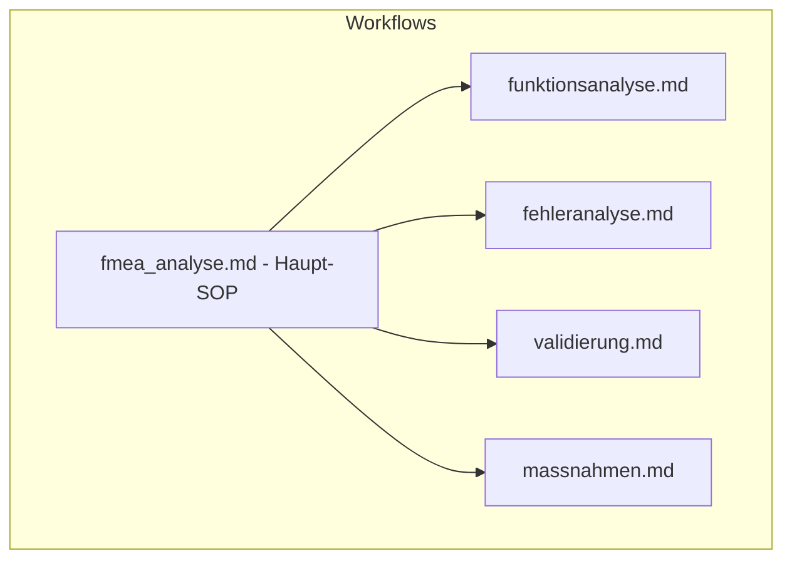

# Workflow-Index

Übersicht aller Workflows (Markdown-SOPs) und ihrer Zuordnung zu Tools.

## Pipeline (Schritt 1–7)

Ablauf aus Sicht des Haupt-SOPs:
1. **Daten laden** → load_plant_data
2. **Strukturanalyse** → structure_analysis, storage
3. **Funktionsanalyse** → funktionsanalyse.md (Agent) → storage
4. **Fehleranalyse** → fehleranalyse.md (Agent) → failure_templates, reliability_lookup, storage
5. **RPZ + Validierung** → rpz_calculator, validierung.md → review
6. **Maßnahmen** → massnahmen.md (Agent) → generate_measures, insert_measures
7. **Report** → report_generator

## Workflows und Tools

| Workflow | Zweck | Verwendete Tools |
|----------|-------|------------------|
| fmea_analyse.md | Haupt-SOP, Human-in-the-Loop | load_plant_data, structure_analysis, storage, workflow_state, review, rpz_calculator, report_generator |
| funktionsanalyse.md | Funktionen pro Komponente | storage |
| fehleranalyse.md | Fehlermodi, S/O/D | failure_templates, reliability_lookup, storage |
| massnahmen.md | Maßnahmen STOP+ABE | storage, generate_measures, insert_measures |
| validierung.md | Konsistenz-Check | review |

## Dateien

- **fmea_analyse.md** – Einstieg: Gesamtablauf mit Review-Punkten nach jedem Schritt
- **funktionsanalyse.md** – Regeln für Haupt-/Nebenfunktionen und Anforderungen
- **fehleranalyse.md** – Fehlermodi, Ursachen, Folgen, Controls, S/O/D-Bewertung
- **massnahmen.md** – STOP-Prinzip, ABE-Hierarchie, Einspielung über insert_measures
- **validierung.md** – Vollständigkeit, Plausibilität, Konsistenz, Doppelungen
